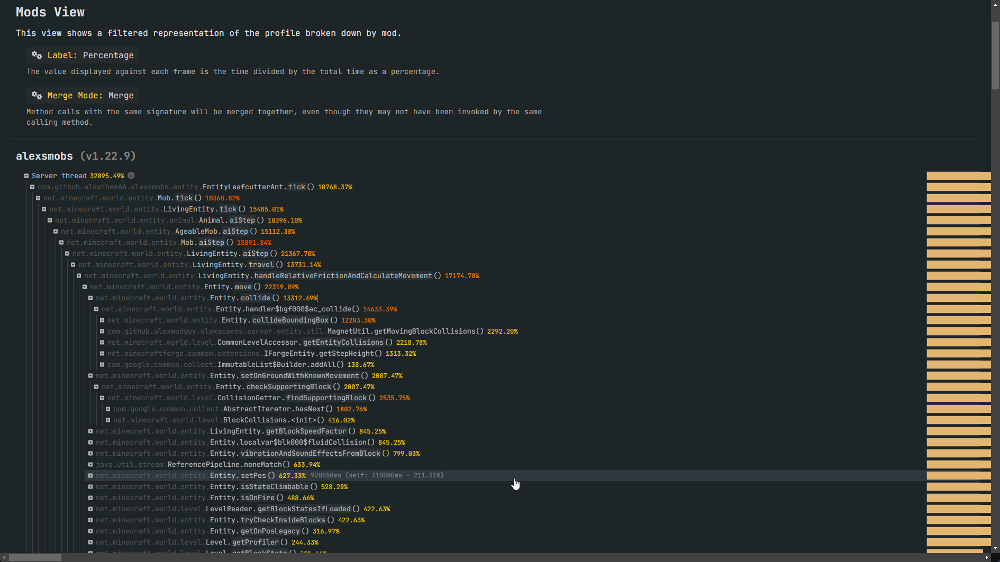
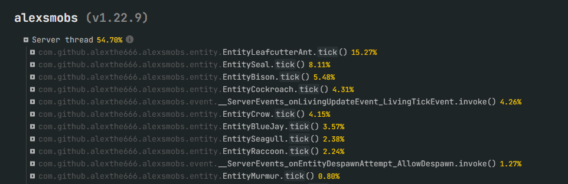

# AlexsMobs-Tweaked

Fork of the Minecraft mod "Alex's Mobs" that adds 80+ new creatures to the game.

The purpose of this fork is to significantly improve the mod's performance & stability.

## The Issue with AlexsMobs
 
Alex's mobs is one of the most popular mods in the Minecraft community, but it has a major issue: it's performance is terrible. The mod is known to cause lag spikes,crashes, 
and other performance issues. This is largely due to the entity AI which is horribly unoptimized. The AI along with the generally unoptimized code causes extreme amounts
of lag.

This is one of my favorite mods but also the most unoptimized mod I've ever seen. Looking into the resource usages of the mod is mind blowing with CPU Usages upto
32,895% with 30-40 total of certain entities spawned (leafcutter, bison, seal etc).

## What does this fork do

The only proper solution would be a partial or full rewrite of the mod. I doubt anyone capable of doing that would have the time or interest to do so for free.
So instead what this fork does is give you more control of the AIs of the entities. Depending on the focus of your modpack, you can adjust these to get the best performance.

I personally play with mods more focused on dungeons & exploration, so I've made the AI of the entities more simple by just disabling most of the AI tasks and really only
keeping the essentials. This has significantly improved the performance of the mod for my use case.

I've also tried to copy what alex has done in the multithreading patch and apply it almost all the mobs, however I have no idea if it actually works or does threading.

_(similar conditions to first instance)_

